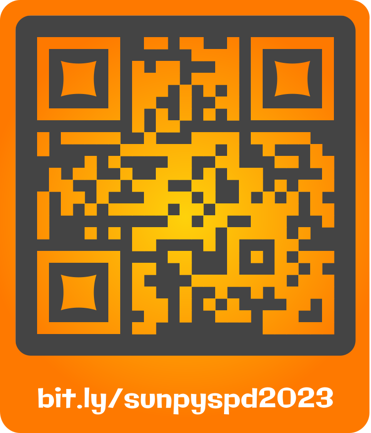

# spd-2023-sunpy-demo #

Notebooks and other materials for the SunPy Demo at the 2023 Solar Physics Division meeting

## Agenda ##

1 hour in total

10-15 minutes: introductory slides

- Current version and new features
- State of the ecosystem (advertise Frontiers paper)
- Advertise sunpy nuggets
- Advertise hands on help on Wednesday

35-40 minutes: demo
5-10 minutes: questions

## During Presentation ##

We'll be running a Slido to gather feedback in real time from the audience.
With the free plan, we can only have three questions and one being live at a time.
The feedback will be targeted towards the project overall, not necessarily specifically towards the presentation.

Public link is: <https://bit.ly/sunpyspd2023>

With QR code: 
